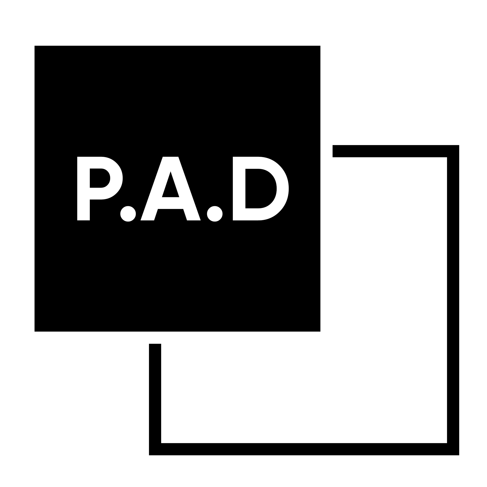

# PAD 
[![Stargazers][stars-shield]][stars-url]
[![Commit Activity][commits-shield]][commits-url]
[![Last Commit][last-commit-shield]][last-commit-url]
[![Issues][issues-shield]][issues-url]
[![Contributors][contributors-shield]][contributors-url]
[![License][license-shield]][license-url]

<br />
<p align="center">
  <a href="https://github.com/ITScoiatael/PAD">
    
  </a>

  <h2 align="center">EShop project</h2>
</p>
<h4 align="center">Multifunctional awesome online clothing store and more.</h4>

<p align="center">
  <a href="#">Table of contents</a> •
  <a href="https://github.com/ITScoiatael/PAD/issues">Report a bug</a> •
  <a href="#license">License</a>
</p>

<details open="open">
  <summary>Table of Contents</summary>
  <ol>
    <li>
      <a href="#about-the-project">About The Project</a>
      <ul>
        <li><a href="#built-with">Built With</a></li>
      </ul>
    </li>
    <li>
      <a href="#getting-started">Getting Started</a>
      <ul>
        <li><a href="#prerequisites">Prerequisites</a></li>
        <li><a href="#installation">Installation</a></li>
      </ul>
    </li>
    <li>
        <a href="#usage">Usage</a>
        <ul>
        <li><a href="#frontend">Frontend</a></li>
        <li><a href="#backend">Backend</a></li>
      </ul>
    </li>
    <li><a href="#contributing">Contributing</a></li>
    <li><a href="#license">License</a></li>
  </ol>
</details>


## Frontend

```bash
# install packages
$ cd frontend
$ npm install

```
### если возникли ошибки попробуйте:
```
$ npm install @nuxtjs/apollo
$ npm install @nuxtjs/tailwindcss
$ npm install @tailwindcss/forms
$ npm install graphql-tag

# server with hot reload at http://localhost:3000/
$ npm run dev

# build for production and launch server
$ npm run build
$ npm run start

# generate static project
$ npm run generate
```


## Backend 


<br>

Installation and launch:
```bash
$ cd backend
$ go get
$ go run github.com/prisma/prisma-client-go generate
$ go mod download github.com/shopspring/decimal
$ cd prisma
$ go run ./server.go
```
### Install [Redis Server](https://github.com/microsoftarchive/redis/releases/tag/win-3.0.504).

GraphQL playground:
http://localhost:8080/playground

### IDs
The online store database is built on the basis of UUID.

What is a UUID. Universally Unique Identifiers, or UUIDS, are 128 bit numbers, composed of 16 octets and represented as 32 base-16 characters, that can be used to identify information across a computer system. 

Example:
> 123e4567-e89b-12d3-a456-426614174000

### Queries
- Categories - Returns all categories
- Category (ID) - Returns the category by ID
- Customers - Returns all customers
- Customer (ID) - Returns the customer by ID
- AllProducts - Returns all products
- Products (categoryID) - Returns all products by category ID
- Product (ID) - Returns the product by ID
- SubProducts (productID) - Returns all subproducts by product ID
- SubProduct (ID) - Returns the subproduct by ID
- Orders (customerID) - Returns all orders by customer ID
- Order (ID) - Returns the order by ID
- OrderedSubProducts (orderID) - Returns all products in the order by its ID
- OrderedSubProduct (ID) - Returns the order product by ID
- Admins - Returns all admins
- Admin (ID) - Returns the admin by ID

### Mutations
- CreateCategory (name, imageURL) - Creates a category
- EditCategory (id, name, imageURL) - Edits the category
- DeleteCategory (ID) - Deletes the category by ID
- AddProduct (categoryID, name, description, image_url) - Adds a product to a category by its ID
- EditProduct (id, name, imageURL) - Edits the category
- DeleteProduct (ID) - Deletes the product by ID
- CreateSubProduct (productID, price, size, color, amount) - Creates a subproduct into the product by its ID
- EditSubProduct (id, price, size, color, amount) - Edits the subproduct
- DeleteSubProduct (ID) - Deletes the subproduct by ID
- CreateCustomer (name, email, phone, address, region, ccNumber) - Creates a customer
- EditCustomer (id, name, email, phone, address, region, ccNumber) - Edits the customer
- DeleteCustomer (ID) - Deletes the customer by ID
- AddOrder (customerID, amount, createdAt) - Adds an order to the customer by his ID
- EditOrder (id, amount, createdAt) - Edits the order
- RemoveOrder (ID) - Removes the order by ID
- AddOrderedProduct (orderID, price, size, color, amount) - Adds a product to the order by its ID
- EditOrderedProduct (id, price, size, color, amount) - Edits the ordered product
- RemoveOrderedProduct (ID) - Removes the product from the order by ID
- CreateAdmin (login, password) - Creates an admin
- EditAdmin (id, login, password) - Edits the admin
- DeleteAdmin (ID) - Deletes the admin by id


### Creators
###### Backend:
- [Slava](https://github.com/Wedyarit)
- [Denis](https://github.com/FaneNohman)

###### Nuxt GraphQL Apollo
- [Zhan](https://github.com/Vafailis)

###### Frontend
- [Artyom](https://github.com/ket02jfu)
- [Daniyar](https://github.com/DanikBruh)
- [Aldiyar](https://github.com/AldiyarSergazy)

###### Design
- [Asima](https://github.com/AsiyaBl)
- [Tima](https://github.com/Hicfok)


Penetration | Ass we can | Dungeon Master


[contributors-shield]: https://img.shields.io/github/contributors/ITScoiatael/PAD.svg?style=for-the-badge
[contributors-url]: https://github.com/ITScoiatael/PAD/graphs/contributors
[stars-shield]: https://img.shields.io/github/stars/ITScoiatael/PAD.svg?style=for-the-badge
[stars-url]: https://github.com/ITScoiatael/PAD/stargazers
[commits-shield]: https://img.shields.io/github/commit-activity/m/ITScoiatael/PAD?style=for-the-badge
[commits-url]: https://github.com/ITScoiatael/PAD/commits/main
[last-commit-shield]: https://img.shields.io/github/last-commit/ITScoiatael/PAD?style=for-the-badge
[last-commit-url]: https://github.com/ITScoiatael/PAD/commits/main
[issues-shield]: https://img.shields.io/github/issues/ITScoiatael/PAD.svg?style=for-the-badge
[issues-url]: https://github.com/ITScoiatael/PAD/issues
[license-shield]: https://img.shields.io/github/license/ITScoiatael/PAD.svg?style=for-the-badge
[license-url]: https://github.com/ITScoiatael/PAD/blob/master/LICENSE.txt
